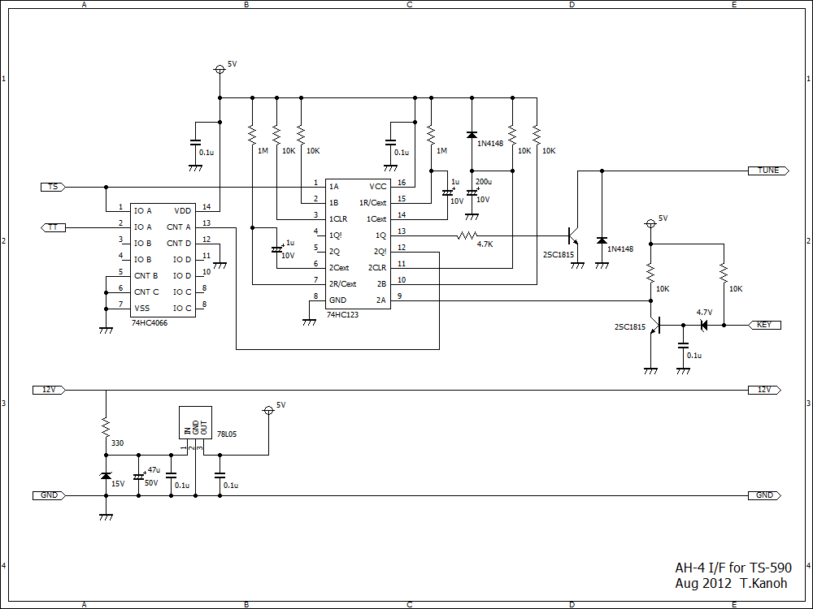
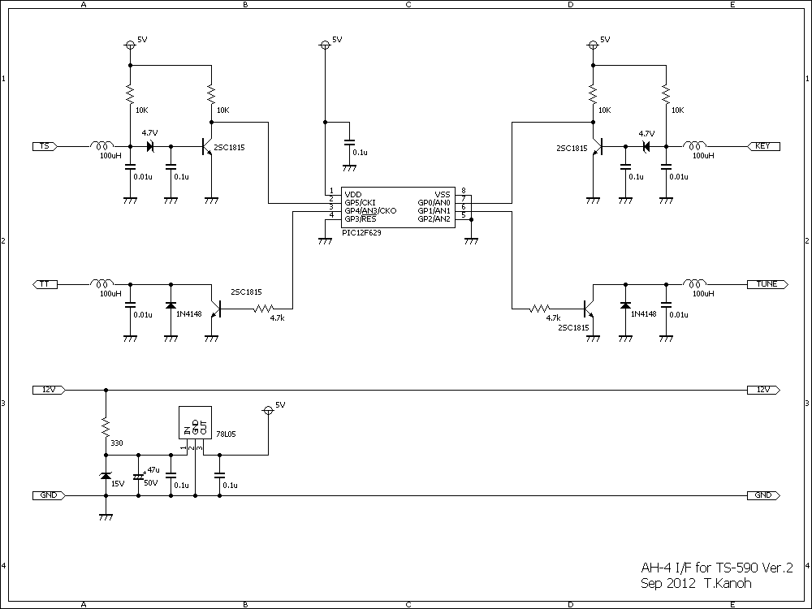
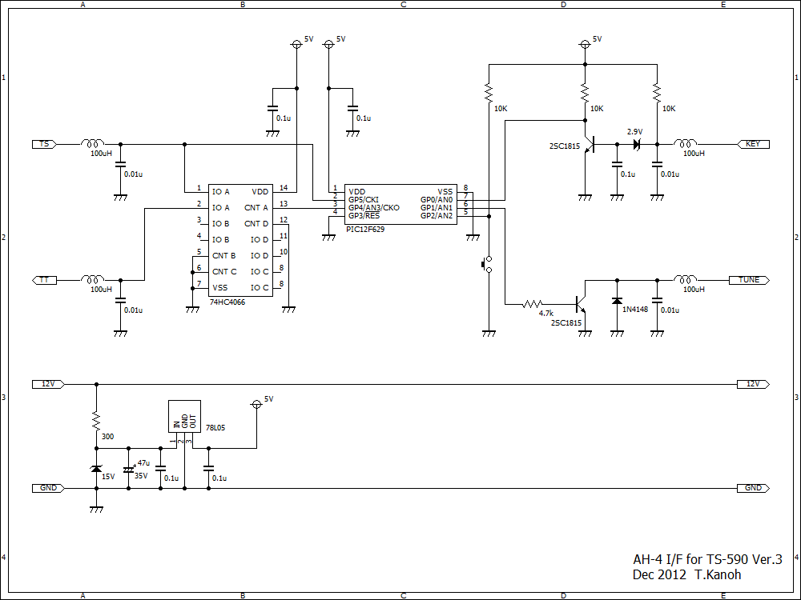

# ah4_if_for_ts590
Interface for controlling ICOM AH-4 auto antenna tuner from KENWOOD [TS-590](http://www.kenwood.com/usa/com/amateur/ts-590sg/ "TS-590").

Schematic.

    Version 1: 
   
    Version 2: 
   
    Version 3: 
   

C source code for Peripheral Interface Controller PIC12F629 in Version 3.

   [ah4_if_for_ts590.c](ah4_if_for_ts590.c)

Schematic data for [BSch3V](https://www.suigyodo.com/online/schsoft.htm "BSch3V").

    Version 1: 
   [ah4_if_for_ts590.CE3](ah4_if_for_ts590.CE3)
    Version 2:
   [ah4_if_for_ts590_2.CE3](ah4_if_for_ts590_2.CE3)
    Version 3:
   [ah4_if_for_ts590_3.CE3](ah4_if_for_ts590_3.CE3)

The connector conforming to the AT connector of [TS-590](http://www.kenwood.com/usa/com/amateur/ts-590sg/ "TS-590") is MLP-06 manufactured by [J.S.T. Connector](http://www.jst-mfg.com/index_e.php "J.S.T. Connector"), and the contact pin is LLF-01T-1.3.
